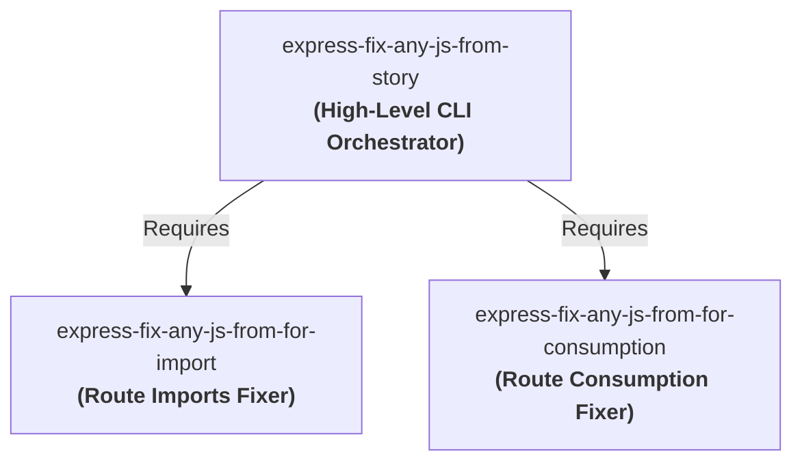

# express-fix-any-js-from-story 🚀

> **The CLI Orchestrator of the Express.js Routing Fixer Suite. Generates, aligns, and coordinates route imports and consumption dynamically.**

[](https://www.npmjs.com/package/express-fix-any-js-from-story)
[](LICENSE)

---

## 📖 The Story of the 3 Repositories

This repository is the high-level orchestration component in a **trio of interconnected packages** designed to cleanly structure, inject, and maintain Express.js routing files with absolute idempotency:



1. **[express-fix-any-js-from-for-import](https://github.com/keshavsoft/express-fix-any-js-from-for-import)**: Focuses strictly on inspecting, formatting, and injecting route/router **import statements** cleanly at the top of Javascript files without duplication.
2. **[express-fix-any-js-from-for-consumption](https://github.com/keshavsoft/express-fix-any-js-from-for-consumption)**: Focuses strictly on inspecting, formatting, and injecting route/router **consumption lines** (`router.use(...)` or `router.post(...)`) in the body of the routes initialization block.
3. **[express-fix-any-js-from-story](https://github.com/keshavsoft/express-fix-any-js-from-story)** *(This Repository)*: The master orchestrator. It receives generation specifications (stories) and coordinates both the **import fixer** and the **consumption fixer** to safely build and update full routing definitions.

---

## ✨ Features

*   **⚡ Orchestrated Cascading Execution**: Takes a single schema specification and runs both import and consumption injection cycles sequentially.
*   **🔒 Complete Idempotency Protection**: Ensures neither imports nor route declarations are duplicated, regardless of how many times the builder is invoked.
*   **📐 Architectural Formatting Compliance**: Maintains correct spacings (empty line after router init, zero-line spacing between consecutive handlers, clean spacing before export blocks).

---

## 🚀 Quick Start

### Installation

```bash
npm install express-fix-any-js-from-story
```

### Usage

```javascript
import fixStory from 'express-fix-any-js-from-story';

// Run orchestrator to update endpoints and imports
fixStory({
  filePath: './app.js',
  importDetails: {
    toInsertLine: "import GetRoutes from './routes/GetRoutes.js';",
    duplicationCheck: "import GetRoutes",
  },
  consumptionDetails: {
    toInsertLine: "router.use('/Get', GetRoutes);",
    duplicationCheck: "router.use('/Get'",
  }
});
```

---

## 🛠️ Developer Technical Guides

For deep-dive documentation on each component:
*   [Developer Docs Home](./docs/index.html)
*   [Import Fixer Documentation](https://github.com/keshavsoft/express-fix-any-js-from-for-import)
*   [Consumption Fixer Documentation](https://github.com/keshavsoft/express-fix-any-js-from-for-consumption)

---

## ⚖️ License

MIT License. Designed with ❤️ by [KeshavSoft](https://github.com/keshavsoft).
