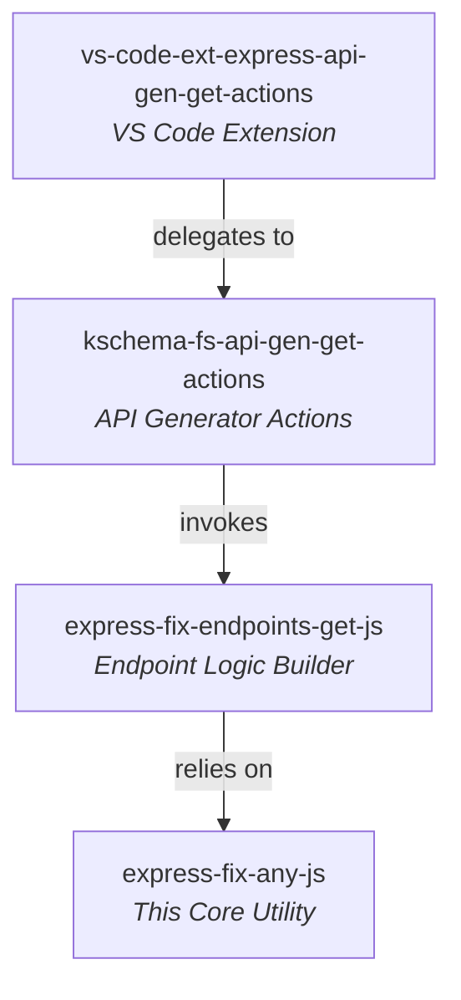

# express-fix-any-js 🚀

> **Instantly repair, structure, and align Express.js routing files with automated idempotency & formatting safeguards.**

[](https://www.npmjs.com/package/express-fix-any-js)
[](LICENSE)
[](https://github.com/keshavsoft/express-fix-any-js/actions)

---

## 📖 Overview

`express-fix-any-js` is a lightweight, high-performance JS AST and file modifier utility. It automatically injects missing Express.js route declarations, import statements, and export configurations into your JavaScript files while ensuring complete protection against code duplication.

This module acts as the foundation layer for the **KeshavSoft API Generation Suite**, dynamically structuring routes generated via CLI or VS Code extensions.

---

## ✨ Features

*   **🔒 Duplicate Prevention (Idempotency)**: Checks files before altering them. If a route or pattern already exists, it skips execution silently to avoid code corruption.
*   **📐 Strict Route Formatting**:
    *   Inserts clean line spaces after `express.Router()` initialization.
    *   Maintains zero-line spacing between consecutive route definitions.
    *   Appends spacing cleanly before the `export` keyword.
*   **⚡ Multiple File Versions (V1 - V6)**: Supports legacy configuration modifications alongside cutting-edge AST-based insertions.
*   **🛠️ Developer-First Diagnostics**: Provides clear inline logging of file updates and duplicate line match warnings.

---

## 📁 Repository Integration Map

`express-fix-any-js` is part of a larger cascading developer ecosystem:



---

## 🚀 Quick Start

### Installation

```bash
npm install express-fix-any-js
```

### Programmatic Usage

You can use the core `alterFile` function to modify local routes files safely:

```javascript
import alterFile from 'express-fix-any-js/bin/v6/UpdateJs/common/AlterFile/index.js';

alterFile({
  jsFilePath: './routes/end-points.js',
  toInsertLine: 'router.post("/Create", express.json(), CreateFunc);',
  duplicationCheck: 'router.post("/Create"',
  insertAfter: [
    'const router = express.Router();',
    'router.post("/Alter"' // Inserts immediately after this line if found, otherwise after Router init
  ],
  showLog: true
});
```

---

## 📜 Structuring Rules

The utility operates under strict structural rules to preserve route aesthetics:

### 1. First Route Placement
When the first route is inserted into an empty routing structure, the file is formatted with breathing space:

```javascript
const router = express.Router();

router.post("/Alter", express.json(), handler);

export { router };
```

### 2. Multi-Route Appending
Subsequent routes are appended directly after the last matching route with no empty line spacing between them:

```javascript
router.post("/Alter", express.json(), handler);
router.post("/Alter1", express.json(), handler);
router.post("/Alter2", express.json(), handler);
```

---

## 🛠️ Developer & API Reference

For detailed developer notes, architectural mappings, and code analyses:
*   [Developer Docs Home](./docs/index.html)
*   [Code Style & Readability Analysis](./docs/code_style_and_readability.md)
*   [AlterFile Workflow Analysis](./docs/alter_file_analysis.md)

---

## ⚖️ License

MIT License. Designed with ❤️ by [KeshavSoft](https://github.com/keshavsoft).
