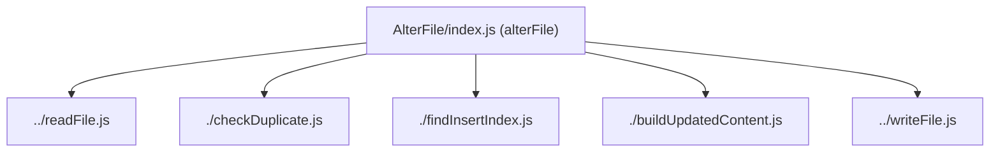
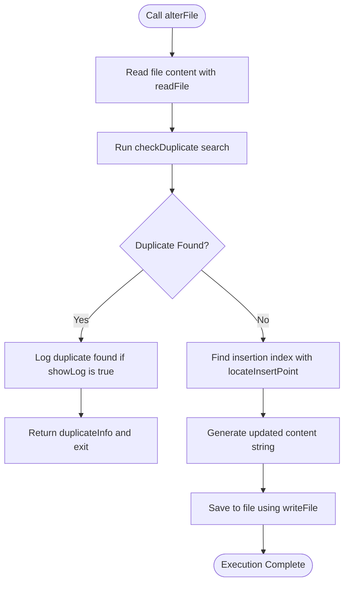

# Analysis of `alterFile` Function

This document details the structure, functionality, and execution flow of the `alterFile` function found in [`express-fix-any-js/bin/v6/UpdateJs/common/AlterFile/index.js`](file:///d:/KeshavSoftRepos/2026-07-12(1)/ks2/express-fix-any-js/bin/v6/UpdateJs/common/AlterFile/index.js).

---

## 1. Overview & Purpose

The `alterFile` function is a utility designed to modify a JavaScript (or text) file by inserting a new line of code at a specific position, but only if that code (or a specified target text) is not already present in the file. This ensures safe, idempotent, and non-duplicate file modifications during codebase updates or scaffolding processes.

---

## 2. File Import Dependencies

The function relies on several modular helper utilities:



*   **`readFile`**: Reads the contents of the target file synchronously.
*   **`checkDuplicate`**: Checks if the target code or search text already exists in the file to prevent duplicate insertions.
*   **`findInsertIndex`** (wrapped by `locateInsertPoint`): Identifies the line/position index where the new content should be inserted, matching against custom pattern criteria.
*   **`buildUpdatedContent`**: Binds the original content, insertion index, and new line together to construct the modified file content.
*   **`writeFile`**: Writes the updated string content back to the target file.

---

## 3. Function Signature and Parameters

```javascript
const alterFile = ({
    jsFilePath,
    toInsertLine,
    duplicationCheck,
    insertAfter = [],
    showLog = false
})
```

| Parameter | Type | Description |
| :--- | :--- | :--- |
| **`jsFilePath`** | `string` | The absolute or relative system path to the target JS file to alter. |
| **`toInsertLine`** | `string` | The actual line of code/text to be inserted into the file. |
| **`duplicationCheck`** | `string` | The search text used to check if the file has already been modified (usually the code line itself). |
| **`insertAfter`** | `array` | A list of string patterns used to locate where the code should be inserted. Defaults to `[]`. |
| **`showLog`** | `boolean` | If set to `true`, logs warning messages (e.g., when a duplicate is found). Defaults to `false`. |

---

## 4. Execution Step-by-Step Flow



1.  **Read File:** The function reads the entire file content into memory:
    ```javascript
    const content = readFile(jsFilePath);
    ```
2.  **Idempotency / Duplication Check:** It invokes `checkDuplicate` to check if `duplicationCheck` already exists in the file.
    *   If a duplicate is found:
        *   If `showLog` is enabled, it logs: ``Duplicate found at line ${duplicateInfo.lineNumber}``.
        *   It exits early, returning the `duplicateInfo` object to the caller without changing the file.
3.  **Locate Target Location:** If no duplicate is found, it finds the exact insertion index by calling `locateInsertPoint`:
    ```javascript
    const insertInfo = locateInsertPoint({ content, insertAfter });
    ```
4.  **Reconstruct File:** It constructs the new updated content by calling `buildUpdatedContent`:
    ```javascript
    const updated = buildUpdatedContent({ content, insertInfo, toInsertLine, insertAfter });
    ```
5.  **Write File:** Finally, it writes the modified content back to the source file synchronously:
    ```javascript
    writeFile(jsFilePath, updated);
    ```
